# Supply Chain Logistics & Financial Performance Analysis

**Course:** DSA3050A – Business Intelligence and Data Visualisation    
**Institution:** United States International University - Africa (USIU)  
**Author:** Misati Nyambane - \*\*\*\*45  

## Project Overview and Data Foundation

This project executes a comprehensive business intelligence lifecycle on a global supply chain dataset comprising 180,519 records. The analysis is built upon a dataset sourced from Mendeley Data and Kaggle under a Creative Commons 0 license, featuring a complex array of 53 categorical and numerical variables. The primary objective is to evaluate delivery efficiency and financial health across diverse geographic markets and product lines. By examining key pillars such as payment methods, scheduled versus real shipping durations, and net profit per order, the study seeks to uncover the root causes of logistical delays and profit leakage. The problem space is defined by the critical need to identify fraudulent patterns and underperforming segments, ultimately answering how the company can pivot its strategy to ensure high-margin, timely operations.

## Data ETL and Transformation Methodology

The raw data underwent a rigorous transformation process within Power Query to ensure both statistical integrity and model performance. To reduce the memory footprint and eliminate noise, 24 irrelevant or sensitive columns—including customer credentials and internal IDs—were removed. Data quality was further enhanced by filtering out "FALSE" placeholders in geographic fields and standardizing inconsistent casing across payment and status columns. A significant portion of the ETL phase involved geographic remapping, such as standardizing the Spanish "EE. UU." abbreviation to "United States of America" and expanding market codes like "LATAM" to "Latin America." To support advanced time-intelligence, order and shipping timestamps were typecast into a standard US locale, allowing the engine to recognize chronological trends rather than treating dates as simple text strings.

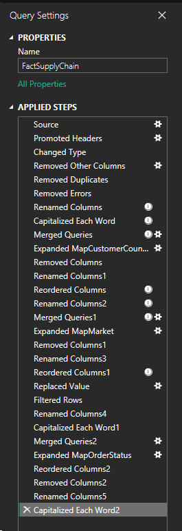

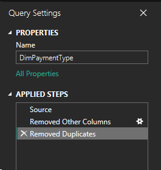

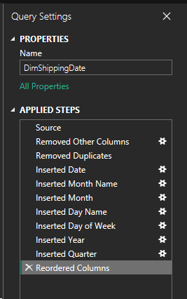

## Architectural Data Modeling

The structural integrity of this analysis relies on a Star Schema architecture, which remains the industry standard for high-performance analytical databases. At the center of this model lies the FactSupplyChain table, acting as the single source of truth for all quantitative measurements. This central hub is surrounded by sixteen specialized dimension tables, ranging from DimProduct to DimPaymentType, which provide the descriptive context necessary to slice and dice the metrics. To handle the complexities of the supply chain lifecycle, the model employs role-playing dimensions for both order and shipping dates. This configuration allows for independent analysis of sales intake versus fulfillment performance. One-to-many relationships and single-direction cross-filtering ensure that calculations remain efficient and free from the ambiguity often found in flatter, less organized data structures.

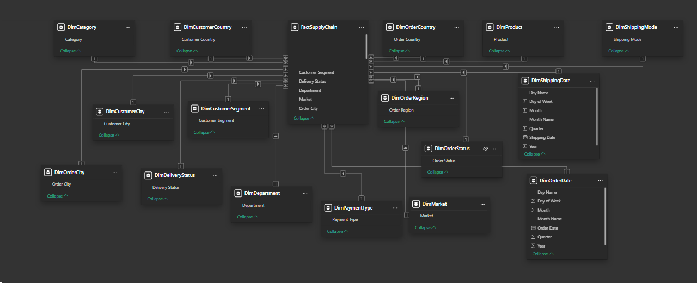

## Analytical Logic and DAX Development

Beyond simple aggregation, this project utilizes custom DAX measures and calculated columns to drive deeper insights. Two primary calculated columns, Order Value Tier and Profitability Segment, allow stakeholders to immediately isolate high-value transactions or loss-making shipments for root-cause analysis. The measurement suite includes core KPIs such as Total Sales and Total Profit, alongside more sophisticated metrics like Profit Margin percentage, which uses safe division to handle zero-denominator errors. To evaluate the company's trajectory, time-intelligence measures were developed to track Year-to-Date performance and Year-over-Year growth. These trend indicators provide a baseline for historical comparison, enabling the business to determine if current strategies are yielding better efficiency than the previous cycle.

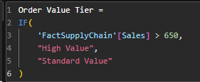

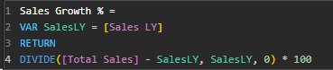

## Dashboard Design and User Experience

The visualization layer is organized into a three-page interactive report consisting of an Executive Summary, a Detailed Analysis page, and a Performance Monitoring dashboard. The design prioritizes scannability, placing synchronized slicers for categories, segments, and shipping modes at the top of each page to ensure a fluid filtering experience across the entire report. While the Executive Summary provides rapid situational awareness through KPI cards and trend charts, the Detailed Analysis page leverages advanced visuals like the Decomposition Tree and Key Influencers. These tools allow analysts to move from a high-level category view down to specific product-level performance, highlighting exactly which factors—such as specific cities or shipping modes—are driving suspected fraudulent activity or logistical bottlenecks.

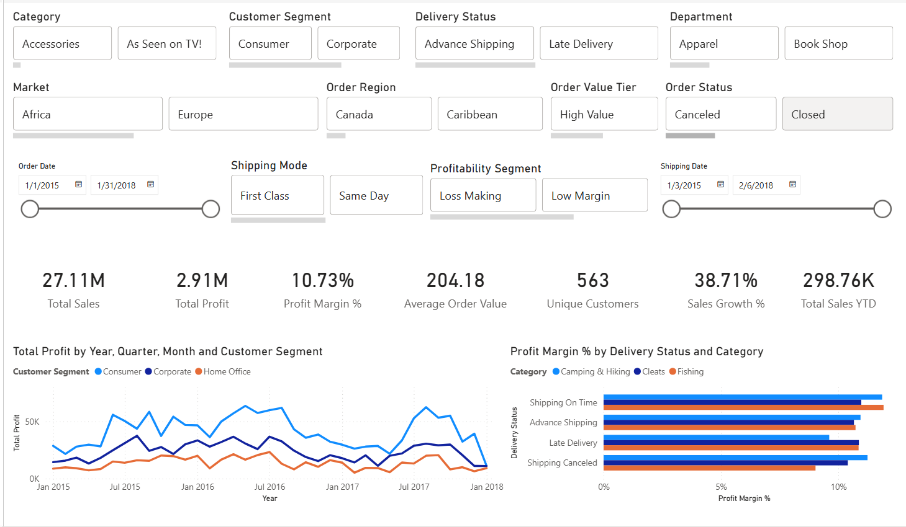

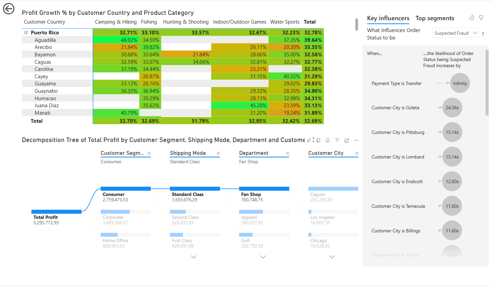

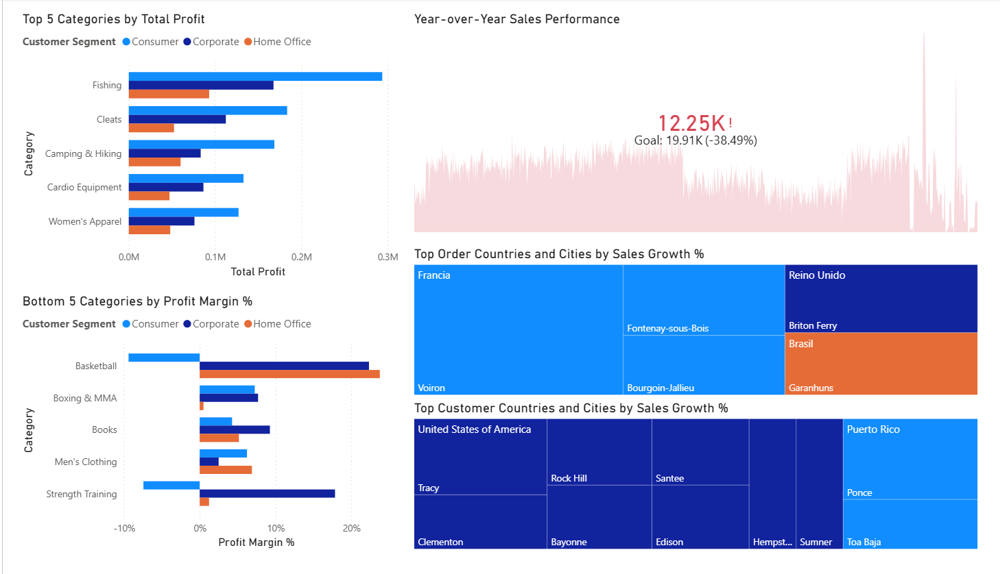

## Strategic Insights and Performance Outcomes

The analysis revealed several critical intersections between logistical operations and financial risk. Most notably, a 100% correlation was discovered between suspected fraudulent transactions and the Bank Transfer payment method, specifically originating from a geographic cluster including Cincinnati, Ewa Beach, and West Jordan. Financially, the company experienced significant profit leakage in the Basketball and Strength Training categories within the Consumer segment. Conversely, Fishing, Cleats, and Camping & Hiking emerged as the "Bread and Butter" categories, maintaining resilient margins across all customer segments. While raw sales volume showed fluctuations, the 2017-2018 calendar year saw a marked improvement in Average Order Value and Sales Growth, suggesting that recent policy shifts toward higher-quality transactions are effectively protecting the bottom line.

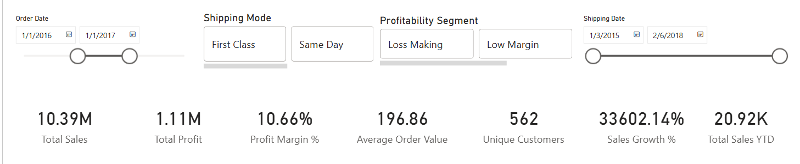

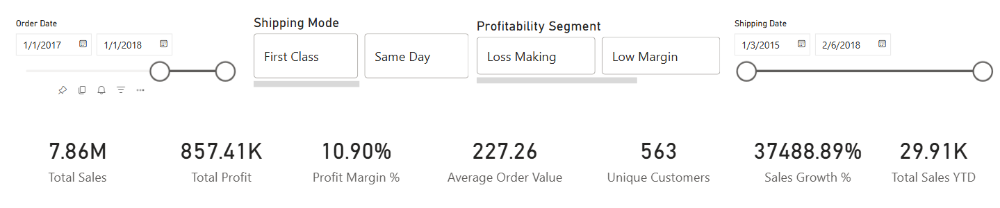

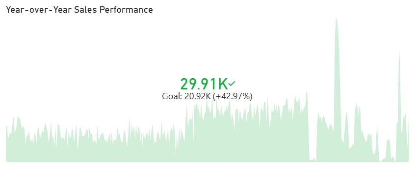

## Conclusions and Recommendations

Based on these findings, it is recommended that the company implement immediate manual audits for all bank transfers originating from the identified high-risk cities. A strategic pivot is necessary to move away from loss-making sports categories and toward the high-margin success seen in Fishing and Cleats. Furthermore, the data highlights a burgeoning export market in Nigeria and Canada, alongside domestic growth hubs in Philadelphia, Detroit, and Las Vegas. By prioritizing infrastructure and logistics lanes toward these high-velocity jurisdictions, the company can capitalize on emerging demand while maintaining the operational excellence observed in the latest fiscal cycle.

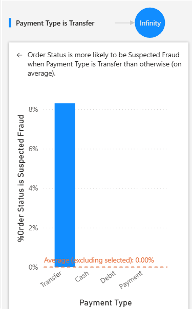

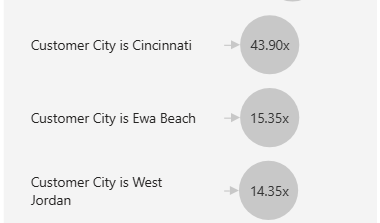

Read the [full report](report/Supply%20Chain%20Logistics%20Analysis.pdf).
